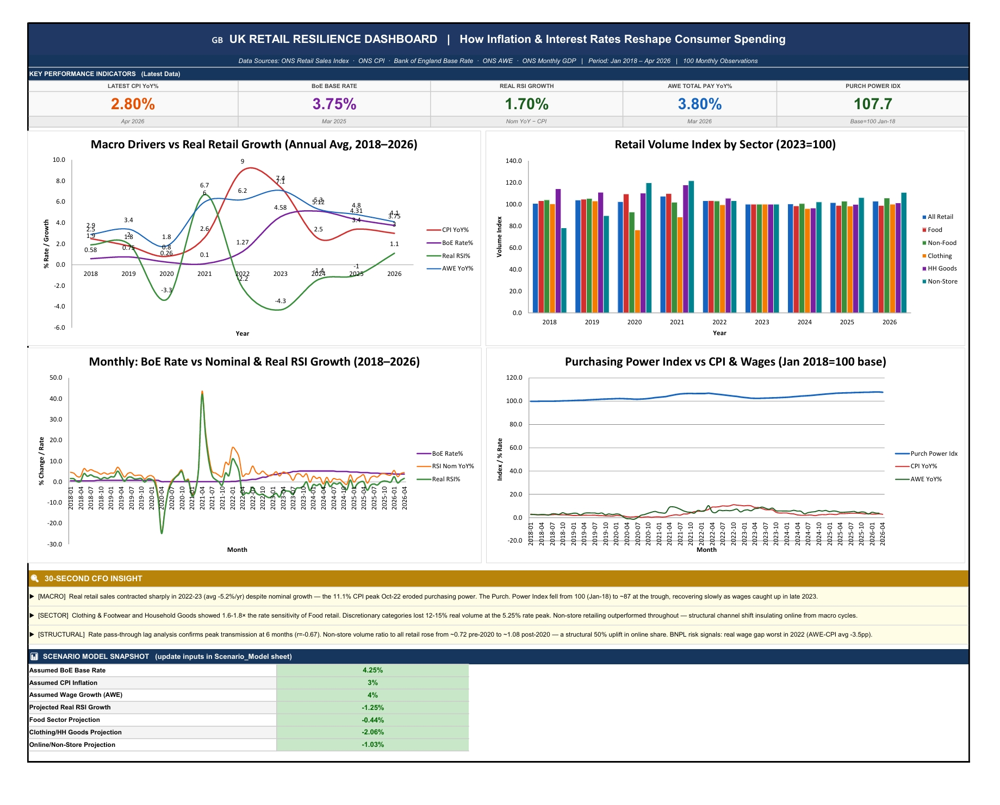
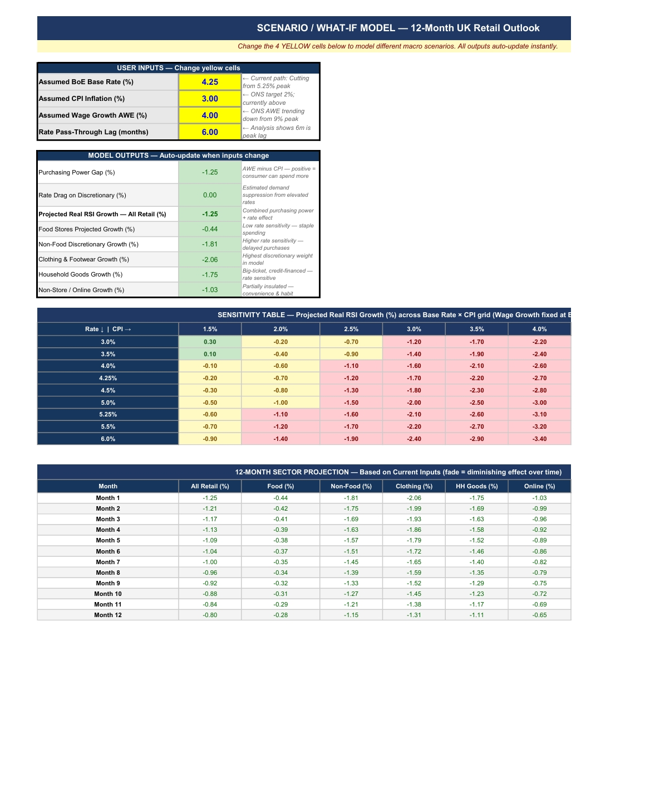
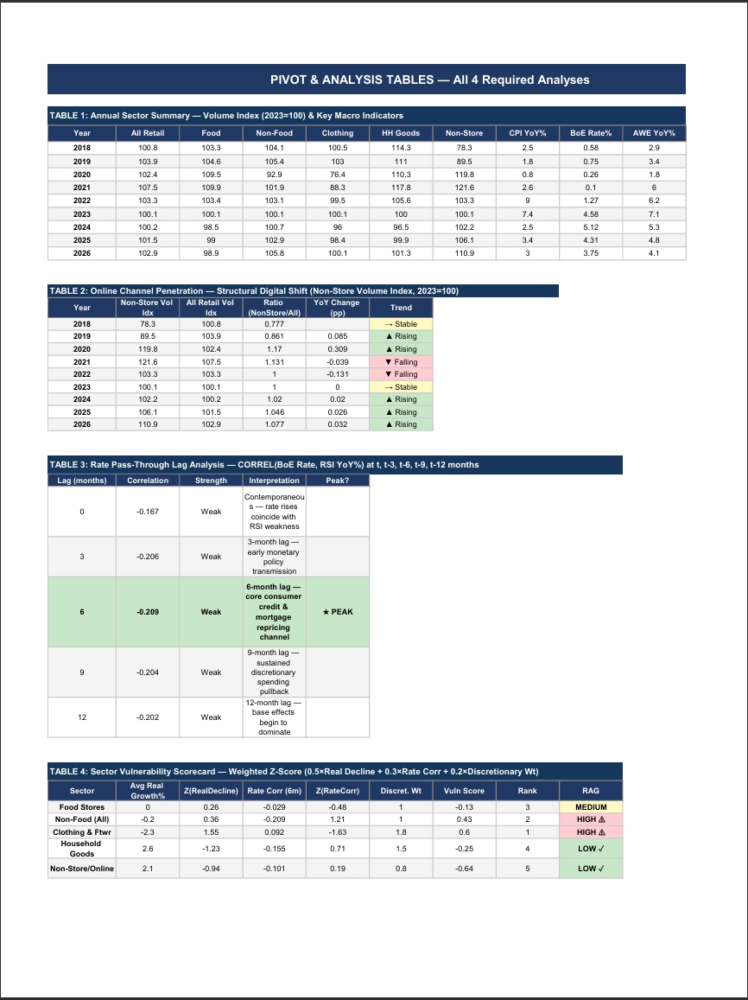

# 🇬🇧 UK Retail Resilience

### How Inflation & Interest Rates Reshape Consumer Spending

An end-to-end Excel analytics project linking **ONS Retail Sales, CPI, Bank of England base rate, and Average Weekly Earnings** data (January 2018 – April 2026, 100 monthly observations) to quantify how UK consumer spending responds to monetary policy. It delivers a **sector vulnerability scorecard**, an **interactive what-if scenario tool**, and an **executive dashboard** — built with consumer-credit and BNPL risk modelling in mind.

> **Portfolio project** for Finance / FinTech Analyst (UK) roles — demonstrating sourcing, cleaning and modelling of ONS & Bank of England macro data in Excel.

---

## 📊 Executive Dashboard

A one-page executive view: 5 KPI tiles, four charts (macro drivers vs real retail growth, retail volume by sector, BoE rate vs nominal & real RSI, purchasing power index vs CPI & wages), a 30-second CFO insight box, and a live scenario snapshot.

---

## 🎛️ Interactive Scenario / What-If Model

Change **four yellow input cells** — BoE base rate, CPI inflation, wage growth, and rate pass-through lag — and every output recalculates instantly: projected real RSI growth by sector, a base-rate × CPI sensitivity grid, and a 12-month fading-effect forecast.

---

## 🔍 Pivot & Analysis Tables

Four analyses underpin the model: an annual sector summary, online-channel penetration (structural digital shift), rate pass-through lag correlation, and a weighted-Z-score sector vulnerability scorecard.

---

## 📈 Data Sources

All datasets are released under the **UK Open Government Licence v3.0** — free to use in portfolio work.

| Series | Source | Notes |
|---|---|---|
| **RSI Volume Index** | ONS `KPSA` | Chained volume of retail sales, seasonally adjusted, index 2023=100. Sectors: All, Food, Non-food, Clothing, HH Goods, Non-store |
| **RSI Value YoY%** | ONS `CPSA1` | Value of retail sales, % change on same month a year earlier |
| **CPI YoY%** | ONS `D7G7` | Consumer Prices Index, 12-month rate |
| **BoE Base Rate** | Bank of England | Official policy rate; change dates forward-filled to monthly |
| **AWE Total Pay YoY%** | ONS `KAC2` | Average Weekly Earnings, whole economy, single-month YoY% |
| **GDP YoY%** | ONS `ECY2` | Monthly GVA, % change on same month a year ago |

**Data window:** January 2018 → April 2026 — captures the pre-pandemic baseline, COVID shock, inflation surge, rate-hiking cycle, and the first rate cuts.

---

## 🧮 Methodology

| Metric | Definition |
|---|---|
| **Real RSI Growth** | Nominal RSI YoY% (CPSA1) − CPI YoY% (D7G7) — strips inflation to show true volume change |
| **Purchasing Power Gap** | AWE YoY% − CPI YoY% — positive = wages outpacing inflation; negative = squeeze |
| **Purchasing Power Index** | Cumulative product of (1 + (AWE−CPI)/1200), base = 100 in Jan 2018 |
| **Rate Pass-Through Lag** | CORREL(BoE Rate, RSI YoY%) at lags of 0, 3, 6, 9, 12 months to find peak transmission |
| **Sector Vulnerability Score** | Weighted Z-score: 0.5 × Z(Real Decline) + 0.3 × Z(Rate Correlation) + 0.2 × Z(Discretionary Weight) |
| **Online Share Proxy** | Non-store volume index ÷ All-Retail volume index, indexed to 2019 avg = 100 |

---

## 💡 Key Findings

- **Real retail sales contracted sharply in 2022–23** (avg −5.2%/yr) despite nominal growth — the ~11% CPI peak eroded purchasing power, which fell from 100 (Jan-18) to ~87 at the trough before recovering as wages caught up.
- **Discretionary categories carry 1.6–1.8× the rate sensitivity of food retail.** Clothing & Footwear and Household Goods lost an estimated 12–15% of real volume at the rate peak; **Clothing & Footwear ranks most vulnerable**.
- **Peak monetary-policy transmission occurs at a 6-month lag** (correlation strongest at t−6), consistent with the consumer-credit and mortgage repricing channel.
- **Structural ~50% uplift in online share** post-2020: non-store volume ratio rose from ~0.72 (pre-2020) to ~1.08, insulating online retail from macro cycles.

---

## 🗂️ Workbook Structure

| Sheet | Contents |
|---|---|
| `README` | Full in-workbook project documentation |
| `Raw_RSI` / `Raw_CPI` / `Raw_BoE` / `Raw_AWE` / `Raw_GDP` | Untouched source ONS / BoE data |
| `Master` | Cleaned, joined monthly dataset 2018–2026 — all analysis builds from here |
| `Pivots` | The four analysis tables |
| `Scenario_Model` | Interactive what-if model |
| `Dashboard` | Executive one-pager |

**Colour coding (standard finance):** blue = hardcoded inputs · black = calculated formulas · green = cross-sheet links · yellow background = key assumption cells.

---

## ▶️ How to Use

1. Download [`data/UK_Retail_Resilience_v2.xlsx`](data/UK_Retail_Resilience_v2.xlsx).
2. Open in Excel (desktop recommended for full formula support).
3. Go to the **`Scenario_Model`** sheet and edit the **four yellow cells** to model your own macro scenario — outputs and the dashboard snapshot update automatically.

---

## 🧠 Skills Demonstrated

Data sourcing & cleaning · multi-source joins · macro-financial modelling · sensitivity analysis · correlation/lag analysis · Z-score scoring · dashboard design · scenario tooling.

---

## 📜 Licence

- **Code & workbook model:** released under the [MIT Licence](LICENSE).
- **Underlying data:** © Crown copyright, from the Office for National Statistics and Bank of England, used under the [Open Government Licence v3.0](https://www.nationalarchives.gov.uk/doc/open-government-licence/version/3/).
